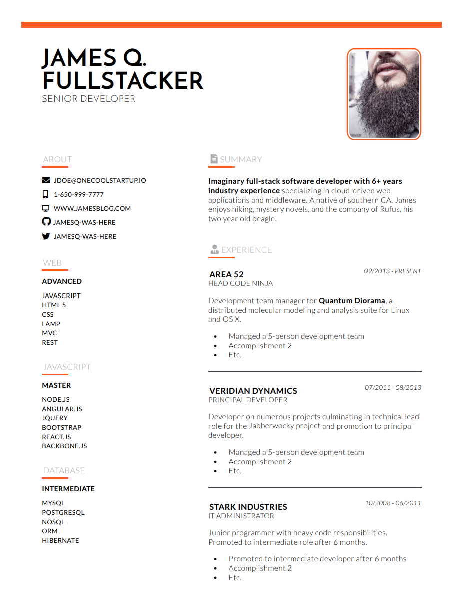

# Theme mocha responsive

Dark, stylish theme strongly based on the [jsonresume-theme-caffeine](https://github.com/kelyvin/jsonresume-theme-caffeine) done by [Kelvin Nguyen](https://github.com/kelyvin). It's a theme for the [JSON Resume](http://jsonresume.org/) project and can by used with the [HackMyResume](https://github.com/hacksalot/HackMyResume) to generate nice resumes in many supported formats.


The theme uses [handlebars](https://handlebarsjs.com/) templating engine for rendering and utilizes [Font Awesome](https://fontawesome.com/). The generated HTML should have very good browser support by explicitly relying on older styling techniques. Although the theme is dark, there is separate tweaked styling for printing, with dark fonts on white background.



The theme can be used with tools supporting asynchronous theme rendering. It converts local or remote profile images to Base64 format, including them directly in the markup, so the generated HTML file can be used standalone. For certain sections (_summary, work, education, volunteer ..._) Markdown markup is supported. __By default__, the image processing and Markdown support are disabled and can be enabled by setting RENDER_MARKDOWN or PROCESS_IMAGE environment variables to _true_.

For usage and issues associated with HackMyResume see the next section.

## Using the theme

The theme supports the [HackMyResume](https://github.com/hacksalot/HackMyResume) tool and shall be fully compatible with [resume-cli](https://github.com/jsonresume/resume-cli). The theme was specifically developed for my own toolkit [KissMyResume](https://github.com/karlitos/KissMyResume) which can utilize the __async rendering__ and __markdown support__.

Install the theme from npm
```bash
npm install jsonresume-theme-mocha-responsive
```
### Using with KissMyResume

The KissMyResume tool will automatically utilize async theme rendering and has support for Markdown markup and conversion of local and remote images to Base64. Set RENDER_MARKDOWN or PROCESS_IMAGE environment variables to _true_  to enable those features.

```bash
RENDER_MARKDOWN=true PROCESS_IMAGE=true kissmyresume build path-to-resume.json --theme jsonresume-theme-mocha-responsive/
```

Yuou can use the `serve` command for live in-Browser preview with hot-reloading on resume changes.

```bash
RENDER_MARKDOWN=true PROCESS_IMAGE=true kissmyresume serve path-to-resume.json --theme jsonresume-theme-mocha-responsive/
```

### Using with HackMyresume

The HackMyResume tool does not support async theme rendering, nor supports it helper transforming images to Base64 or converting markdown to HTML. Those helpers are disabled by default and yo should not use them with HackMyResume.

Due to the [current bug](https://github.com/hacksalot/HackMyResume/issues/161) in the HackMyResume remote profile pictures are not supported. See [proposed workaround](https://github.com/hacksalot/HackMyResume/issues/161#issuecomment-441393008) in the comments.

```bash
hackmyresume build path-to-resume.json --theme node_modules/jsonresume-theme-mocha-responsive/
```

### Using with [resume-html](https://github.com/hankchiutw/resume-html)

You can render your resume in HTML (and print it to PDF) with the resume-html tool.

Set RENDER_MARKDOWN or PROCESS_IMAGE environment variables to _true_ to enable Markdown support and conversion of local and remote images to Base64.

```bash
RENDER_MARKDOWN=true PROCESS_IMAGE=true path/to/resume-html/index.js outputFileName.html --resume path/to/resume.json --theme path/to/jsonresume-theme-mocha-responsive/
```

## License

Available under [the MIT license](http://mths.be/mit).
