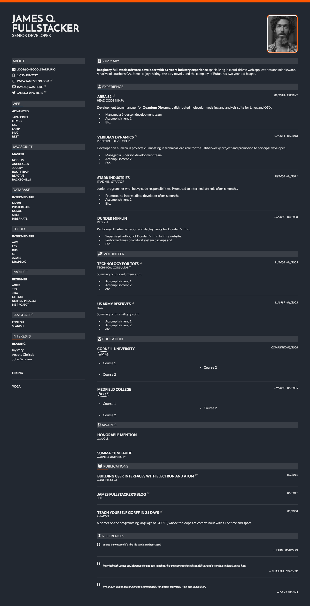

# Theme mocha responsive

Dark, stylish theme strongly based on the [jsonresume-theme-caffeine](https://github.com/kelyvin/jsonresume-theme-caffeine) done by [Kelvin Nguyen](https://github.com/kelyvin). It's a theme for the [JSON Resume](http://jsonresume.org/) project and can by used with the [HackMyResume](https://github.com/hacksalot/HackMyResume) to generate nice resumes in many supported formats.

The theme uses [handlebars](https://handlebarsjs.com/) templating engine for rendering and utilizes [Font Awesome](https://fontawesome.com/). The generated HTML should have very good browser support by explicitly relying on older styling techniques.

The theme can be used with tools supporting asynchronous theme rendering. It converts local or remote profile images to Base64 format, including them directly in the markup, so the generated HTML file can be used standalone. For certain sections (_summary, work, education, volunteer ..._) __By default__, the image processing and    

For usage and issues associated with HackMyResume see the next section.

## Using the theme

The theme supports the [HackMyResume](https://github.com/hacksalot/HackMyResume) tool and shall be fully compatible with [resume-cli](https://github.com/jsonresume/resume-cli).

### Using with HackMyresume

The HackMyResume tool does not support async theme rendering, nor supports it helper transforming images to Base64 or converting markdown to HTML. Those helpers are disabled by default and yo should not use them with HackMyResume.

## License

Available under [the MIT license](http://mths.be/mit).
